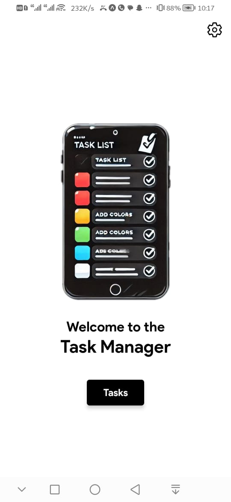
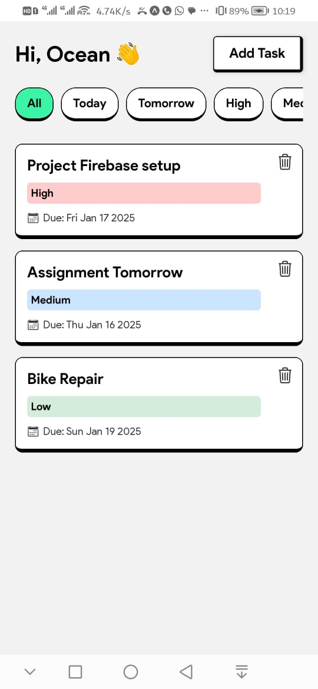
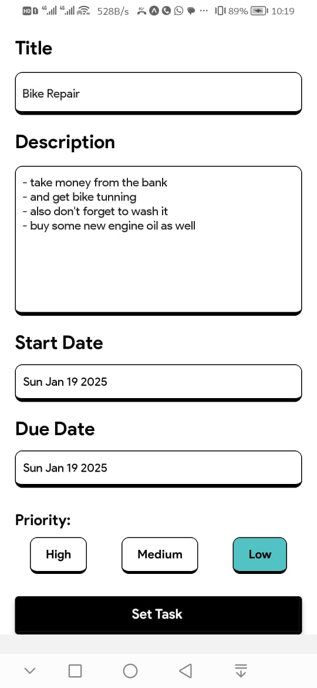
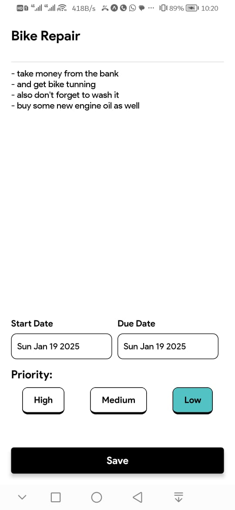

# Task Manager App

This is a Task Manager application built using React Native and Expo SDK 48. The app allows users to manage their tasks, set priorities, and view task details. It also includes the ability to add and edit tasks.

## External Libraries Used

- `@react-native-async-storage/async-storage`: For storing tasks locally.
- `@react-native-community/datetimepicker`: For selecting dates.
- `@react-navigation/native`: For navigation.
- `@react-navigation/native-stack`: For stack navigation.
- `expo-font`: For loading custom fonts.
- `expo-status-bar`: For managing the status bar.
- `react-native`: Core React Native components.
- `react-native-vector-icons/Ionicons`: For icons.

## Steps to Run the Project

1. **Clone the repository:**
   ```sh
   git clone https://github.com/hussain2125/TaskManager-ReactNative.git
   cd TaskManager-ReactNative
   ```

2. **Install dependencies using Yarn:**
   ```sh
   yarn install
   ```
    **Note**: if you don't have yarn in your pc then run this command: (otherwise skip this step)
    ```sh 
    npm install -g yarn
    ```
3. **Start the Expo development server:**
   ```sh
   npx expo start
   ```

4. **Run the app on an emulator or physical device:**
   - **For Physical Android devices:** Use the Expo Go app (version 2.28.2) to scan the QR code generated.
   ---
   - **Warning:** The current Expo Go app downloaded on your phone might be the latest version, which will not run the app. You need the lower SDK 48 Expo version (2.28.2), which can be downloaded from the link provided below.
   ---

5. **Download Expo Go (Android):**
    - [Expo Go 2.28.2 for Android](https://expo.dev/go?sdkVersion=48&platform=android&device=true) <--- click this link to download apk

## Requirements

- **Expo SDK:** 48
- **Expo Go:** Version 2.28.2 (for testing on emulator or phone)
- **Yarn:** For dependency management


## Features

- **Welcome Screen:** A welcome screen with an option to edit the user's name.
- **Task List:** A list of tasks with filtering options (All, Today, Tomorrow, High, Medium, Low).
- **Add Task:** A screen to add new tasks with title, description, start date, due date, and priority.
- **Task Details:** A screen to view and edit task details.
- **Calendar View:** A placeholder screen for the calendar view (coming soon).

## Screenshots






## License

This project is licensed under the MIT License. See the [LICENSE](LICENSE) file for details.